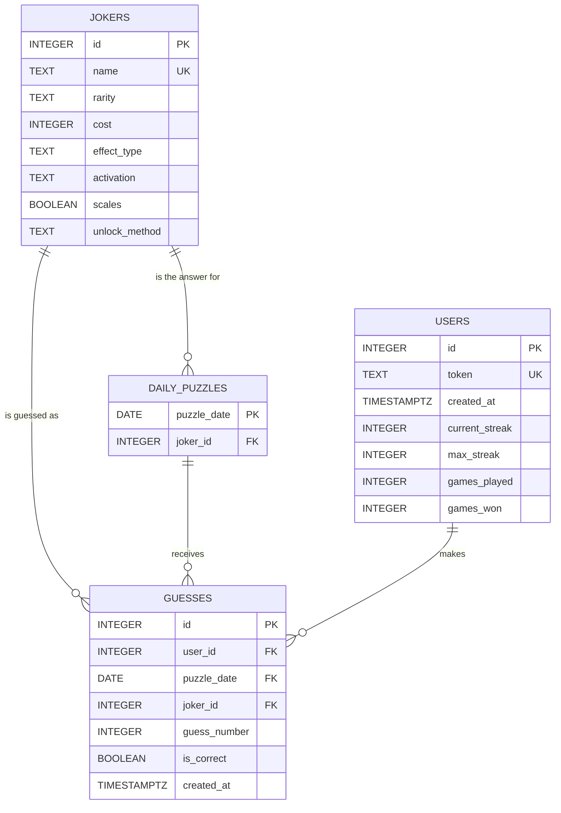

# Balatdle database design

Four tables in PostgreSQL. All subject to change as I work through the application.

## Entity relationship diagram

## Notes on the design

**jokers** holds one row per joker, with the six attributes the game compares. `rarity` is limited to the four rarities in Balatro with a CHECK constraint, so a typo in the seed file fails at insert time instead of showing up as a broken clue during a game.

**daily_puzzles** uses the date itself as the primary key, so there can only ever be one puzzle per day. The answer is a foreign key to `jokers`, and it is never sent to the browser. The backend reads it when checking a guess.

**users** identifies a player by a random token that the browser keeps in local storage. There is no account and no password. Streak and win counts are stored on the row so the stats endpoint is a single read instead of a scan over every past guess.

**guesses** records one row per attempt. The unique constraint on (user_id, puzzle_date, guess_number) stops the same attempt from being written twice, and the index on (user_id, puzzle_date) covers the query that loads a player's progress for today.
